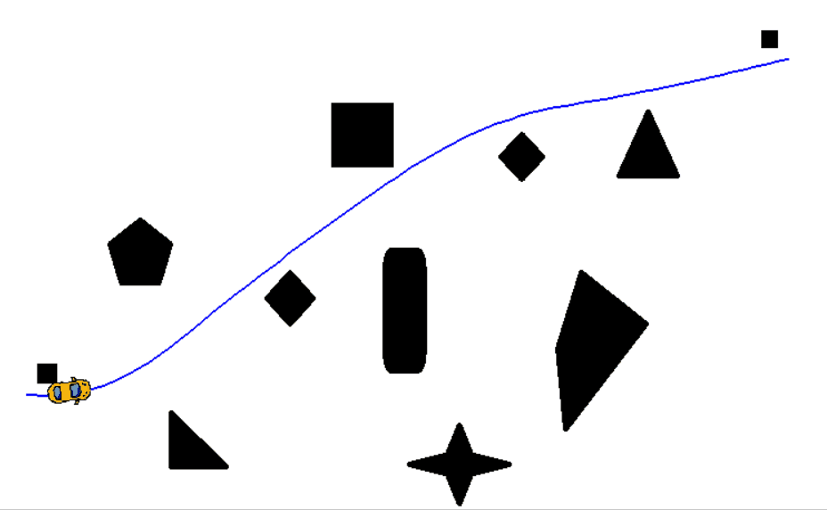
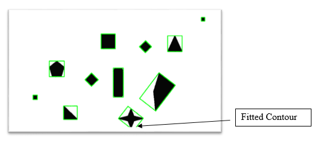
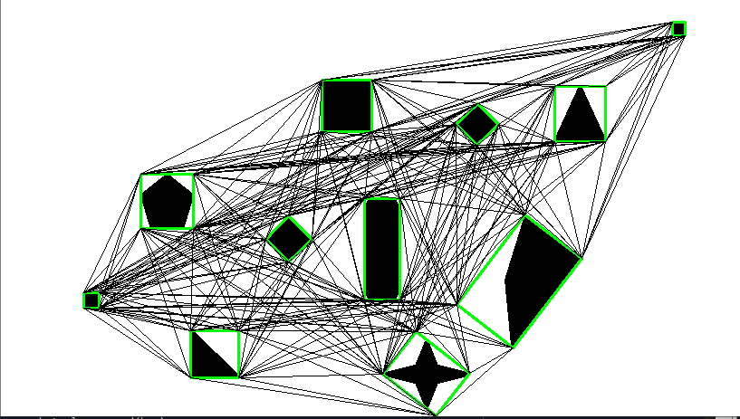
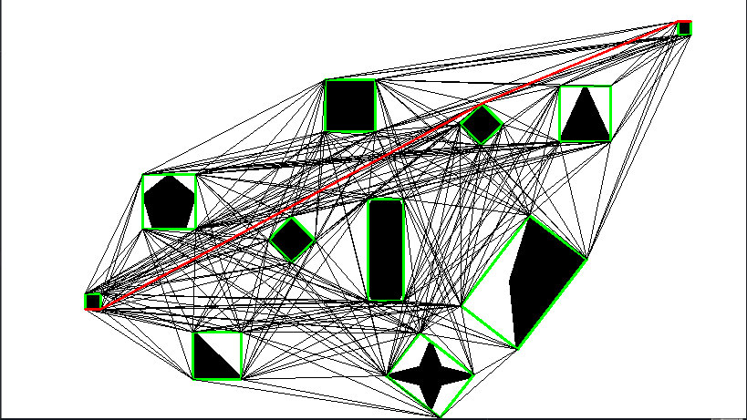
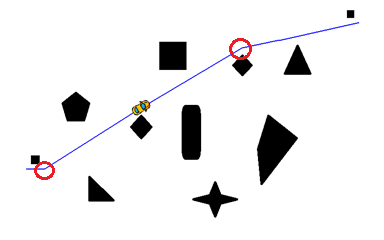
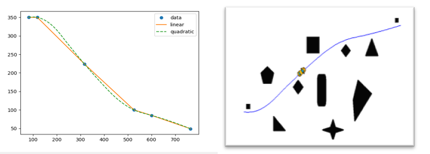

# Motion-Planning-of-a-differential-drive-robot-
This project aims to combine the image processing with path planning techniques to extract an obstacle course using a camera and process the image to segment obstacles. Then, we test various path planning algorithms to get the shortest path. Once the path is generated, the path is smoothened using spline interpolation. Further, the differential drive motion planning equations are used to navigate the drive on the path and appropriate control algorithm is applied to mitigate the errors.

Objective of this project is not only to successfully track but to enhance tracking ability of the system by improving algorithms and control system. Efforts will be towards achieving tracking at higher framerate and at higher resolution then currently achieved by some people. During this project the obstacle detection part will be carried out using several Computer Vision algorithms and image processing techniques. The developed system has many applications in advance systems including defense, surveillance, monitoring, humanoid robots, etc. Also a method to evaluate performance of the system has to be developed. The scope of the present work involves the conceptual design and assembly of the tank drive robot, its wireless control and a python “Pygame” simulation of the robot navigating different paths on different obstacle courses. 

**For Hardware Integration and Communication Protocol refer [this repository](https://github.com/savnani5/Wireless-robot-control)** 

## Obstacle Detection
A contour can be explained as a curve joining all the continuous points (along the boundary), having same color or intensity. The contours are a very useful tool for shape analysis and object detection and recognition. We need contour detection to separate the obstacles from the background, so that we can draw the visibility graph using the obstacle corners. Also, to account for any convexity and continuity in obstacles, we fit a 4-sided polygon to each obstacle using its extreme points, so as to simplify the construction. In below figure the green polygons surrounding the different shaped obstacles are the fitted contours. 

The green contours are made using the minimum bounding area, so it considers the rotation also. The function used is cv2.minAreaRect(). It returns a Box2D structure which contains following details - (top-left corner(x, y), (width, height), angle of rotation). But to draw this rectangle, we need 4 corners of the rectangle. It is obtained by the function cv2.boxPoints().

**Obstacles may be inflated using Minkowski Sum to compensate for the close tolerances.** 

## Path Planning
Path planning is a task of finding a continuous path from the start point to the goal point. When path planning for the robot is done, it is assumed to be a point object traversing on the path, thus its movements are considered in motion planning of the robot. 

### Graph Generation
A visibility graph is a graph of intervisible locations, typically for a setwof points and obstacles in the Euclidean plane. Each node in the graph represents a point location, and each edge represents a visible connection between them. That is, if the line segment connecting two locations does not pass through any obstacle, an edge is drawn between them in the graph. When the set of locations lies in a line, this can be understood as an ordered series. Here, a set of n disjoint-polygonal obstacles are given in the plane, and two points start point and the goal point that lie outside of the obstacles. We have to determine the shortest path from start to goal that avoids the interiors of the obstacles. To solve this problem, the shortest path between any two points in the graph is that, which avoids a set of polygonal obstacles and forms a polygonal curve, also whose vertices are either vertices of the obstacles or the points start position and goal position. 

To construct the visibility graph we must determine which vertices are visible from a given vertex. To do this:

- Input a series of vertices〖 n〗_i, whose edges do not intersect (total of N)
- Joinfthe givenfvertex n_g to all other vertices n_i (which has a total of N-1).
- Furthermore, check if the line segment n_g n_i intersects the given N edges.
- Keep repeating the procedure for every vertex (total of N).
- This algorithm has a time complexity of  O(n^3).

### Graph Search

Dijkstra’s algorithm is quite an efficient algorithm to find the shortest path in the graph. It is different from minimum spanning tree because the shortest distance between two vertices might not include all the vertices of the graph. This algorithm uses a greedy approach, in the sense that we find the next best solution hoping that the end result is the best solution for the whole problem.

Here, we need to store the path distance of every vertex. It can be stored in an array of size v (number of vertices). Also along with the length of the shortest path, we want to get the shortest path. For this, we map each vertex to the vertex that last updated its path length. Once the algorithm is complete, we can easily backtrack from the destination vertex to the source vertex to ascertain the path. To improve the algorithm, a minimum priority queue can be used to efficiently receive the vertex with least path distance. Normally, the time-complexity of this algorithm is O(n^2), but the computational complexity with priority queue data structure is reduced to :

`O((|V|+|E|)log|V|)`

|V| denotes the number of nodes in the graph and |E| denotes the number of edges.

## Motion Planning and Control Simulation

### Kinematic modelling of the Robot
The inputs required for the motion of a mobile robot are the linear velocity (V) and the orientation θ. The rate of change of position of robot in x-direction is x ̇ and that in y-direction is y ̇ and the angular velocity are given by: 
`V = (V_r + V_l)/2`

The individual velocities, V_R and V_L, will be:

`V_r = V + (L/2)w`

`V_l = V - (L/2)w`

The outputs, V_R and V_L, can now be used to generate the output x ̇, y ̇, ω. The actual orientation θ is fed back for error calculation, making this system a closed loop system. This error is feed into a PID controller and appropriate output is received.

### Simulation
Pygame module in python is used for creating games and animation in python. It is the Python wrapper for the SDL library, which stands for Simple DirectMedia Layer. SDL provides cross-platform access to your system’s underlying multimedia hardware components, such as sound, video, mouse, keyboard, and joystick. This project uses Pygame to simulate the robot kinematic movements on the shortest path generated by the Dijkstra’s algorithm. There is a perpetually running while loop, in which all the pygame events occur.

The code has two main functions i.e get_angle() and drive(), these functions help to get the desired angle of the robot at each iteration and the drive function provides the instantaneous X and Y velocities. The obstacle course and the shortest paths are loaded from the visibility graph code from previous chapter. Below Figure shows the robot car simulation, notice the path is not a smooth path. The circles drawn on the images shows the sharp angle turns in both the obstacle courses. Now, in real world scenarios the car cannot turn about its geometric centre, due to large turning radius the below paths are not feasible in real life. So, to solve this problem, I have applied the spline interpolation between the discrete points obtained from the algorithm.  

For this use-case, SciPy python module’s interpolation function is used for spline interpolation to smoothen the path. The splines were generated with a data of 100 points and the interpolation method was selected according to the deviation from the original curve.

## How to Run the Code
1) In *Code_files* directory run `python obstacle_detection.py` for contour creation.
2) In *Code_files* directory run `python visibility_graph.py` for obstacle inflation, graph generation and graph search.
3) In *Code_files/pygame_simulation* run `python pygame_sim.py` for the simulation visualization in pygame.

## Dependencies
- numpy
- cv2
- matplotlib
- scipy
- shapely
- pygame
- socket

## References
1) Steven M. LaValle, University of Illinois, Planning Algorithms
2) Rosebrock, D. A. (2016). Practical Python and OpenCV: An Introductory, Example Driven Guide to Image Processing and Computer Vision. pyimagesearch.
3) Subir Kumar Ghosh, Visibility-based Robot Path Planning -School of Technology & Computer Science Tata Institute of Fundamental Research.
4) K. N. McGuire1∗, G.C.H.E. de Croon1 and K. Tuyls2 Delft University of Technology, The Netherlands, University of Liverpool, United Kingdom, A Comparative Study of Bug Algorithms for Robot Navigation
5) Cherry Myint, Nu Nu Win, (IJSETR) Volume 5, Issue 9, September 2016 -Position and Velocity control for Two-Wheel Differential Drive Mobile Robot
6) Kaamesh Kothandaraman, Motion Planning and Control of Differential Drive Robot- Wright State University.
7) Marcell Missura1, Daniel D. Lee2, and Maren Bennewitz, Minimal Construct: Efficient Shortest Path Finding for Mobile Robots in Polygonal Maps
8) [ESP32 Datasheet](https://www.espressif.com/sites/default/files/documentation/esp32_datasheet_en.pdf)
9) [L298N Motor driver Datasheet](https://www.sparkfun.com/datasheets/Robotics/L298_H_Bridge.pdf)
